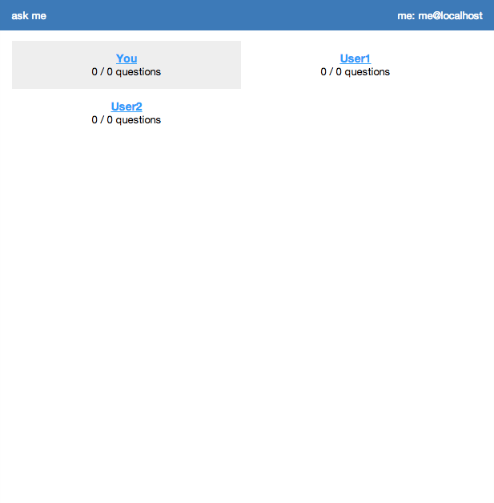
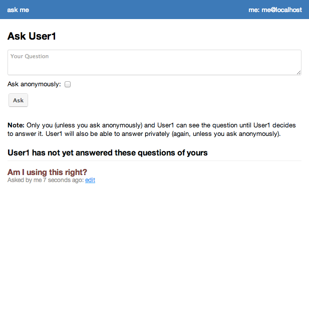
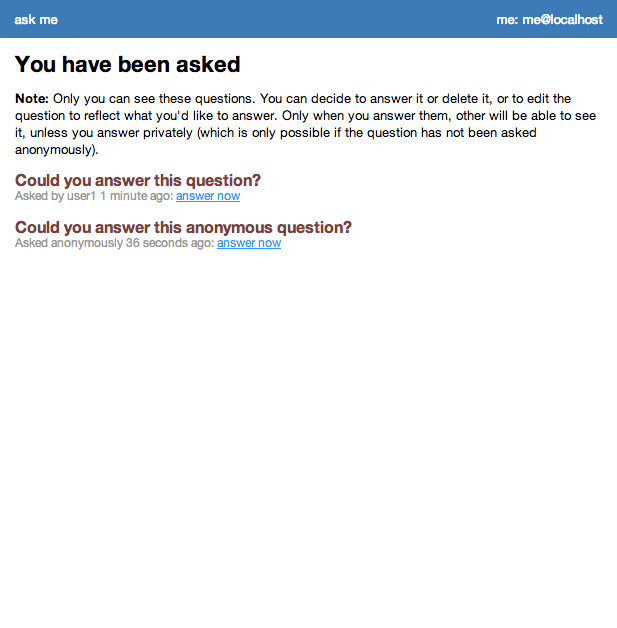
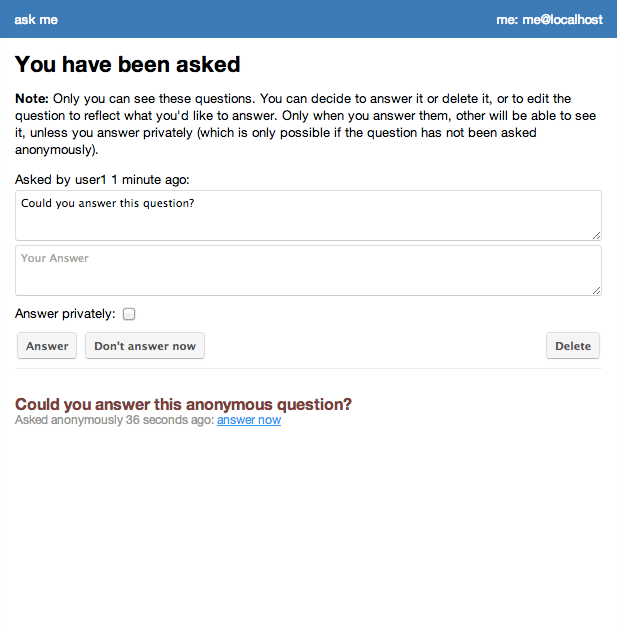
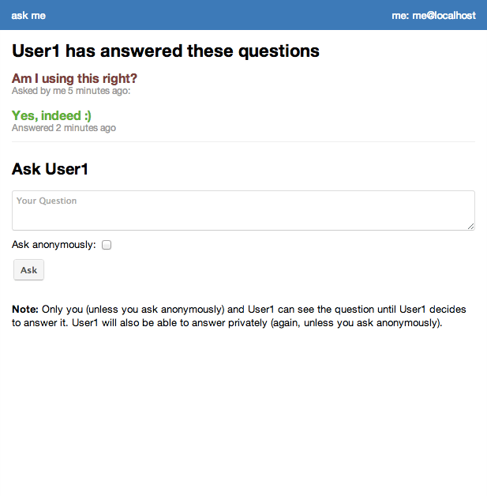

ask me
======

This is a very simple formspring/spring.fm like question and answer script.

There is no user management (register, login, profile), authentication is supposed to be through HTTP Basic Authentication. There is a user table that can be extended to what you need.

Features
========

 - Ask any user a question
 - Questions can be asked anonymously
 - Questions can be modified before answering
 - Questions can be answered privately if they have not been asked anonymously
 - Notifications about questions and answers by e-mail
 - Questions and answers can be edited

Requirements
============

PHP5, mysqli, MySQL

Setup
=====

1. Import schema.sql
2. Copy `config.php.dist` to `config.php` and modify it accordingly.
3. Copy `messages.php.dist` to `messages.php` and modify it accordingly.
4. Modify `style.css` or `style.scss` to your needs (generate a new `style.css` by running `scss style.scss > style.css`)

Screenshots
===========

