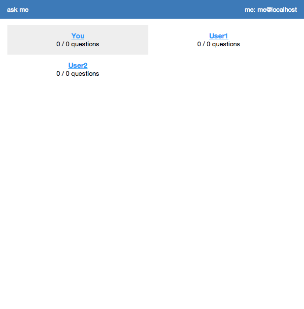

ask me
======

This is a very simple formspring/spring.fm like question and answer script.

There is no user management (register, login, profile), authentication is supposed to be through HTTP Basic Authentication. There is a user table that can be extended to what you need.

Features
========

 - Ask any user a question
 - Questions can be asked anonymously
 - Questions can be modified before answering
 - Questions can be answered privately if they have not been asked anonymously
 - Notifications about questions and answers by e-mail
 - Questions and answers can be edited

Requirements
============

PHP5, mysqli, MySQL

Screenshots
===========

